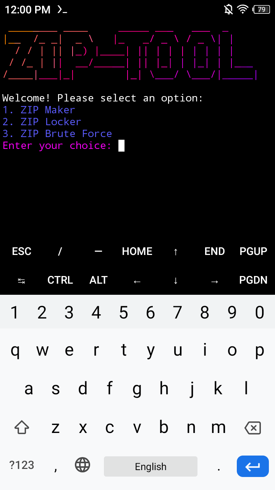

<h1 align="center">ZIP-TOOL<br>
</h1>


#
#
# Download Termux App 
You can download the latest termux app from here <a href="https://f-droid.org/en/packages/com.termux/">Link</a>

# Installation Process on Termux
<b>Copy entire this code and paste on termux👇 if ask for any Yes or No then just tap on Enter<b>
```shell
apt update && apt upgrade -y
apt install git
git clone https://github.com/Ttechnical/ZIP-TOOL.git
cd ZIP-TOOL 
chmod 777 setup.sh
./setup.sh
```
# Usage
### Step1
Open termux app
### Step2
```bash
zipT
```
(👆type this code in your termux and hit enter for run the tool)

### Step3
Choose the option from list.
### Step4
And use it.
